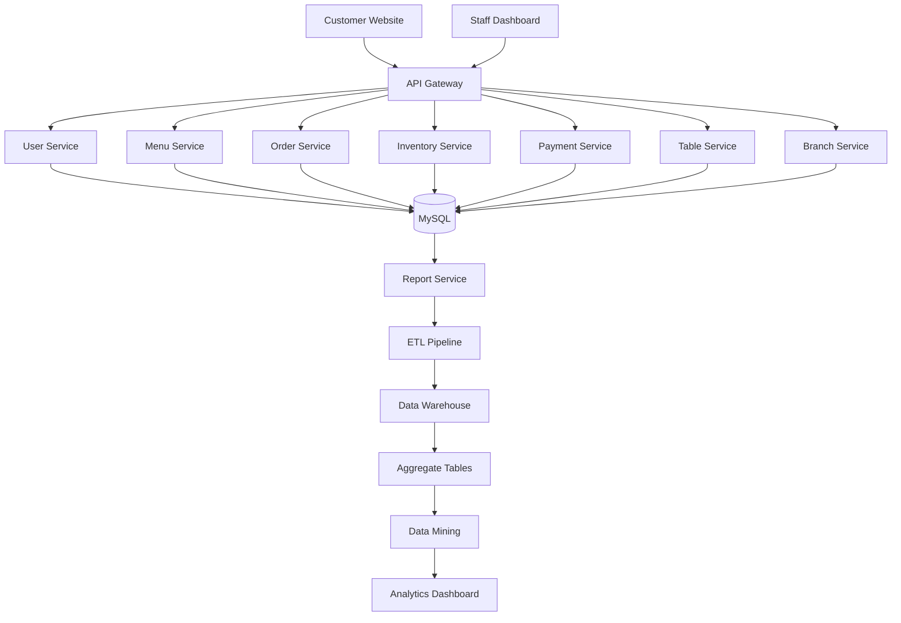
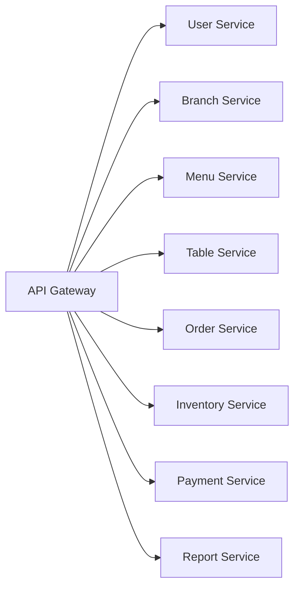

# PIZZA 4P's - Hệ thống quản nhà hàng 
Hệ thống quản lý nhà hàng theo kiến trúc Microservices dành cho chuỗi nhà hàng Pizza, hỗ trợ quản lý khách hàng, thực đơn, bàn ăn, đơn hàng, bếp, kho nguyên liệu, thanh toán, báo cáo và phân tích dữ liệu. Dự án được xây dựng nhằm số hóa toàn bộ quy trình vận hành nhà hàng, từ đặt món → bếp → thanh toán → quản lý kho → báo cáo → Data Warehouse, đáp ứng khả năng mở rộng cho nhiều chi nhánh.
# Demo
## 🌐 Website Khách hàng
Truy cập: http://57.158.27.22:3000
Người dùng có thể:
- Đăng ký tài khoản mới để trải nghiệm hệ thống.
- Hoặc đăng nhập bằng tài khoản mẫu:

- **Tên đăng nhập:** `hyntrem`
- **Mật khẩu:** `1234`
---
## 👨‍💼 Website Quản trị (Nhân viên/Admin)
Truy cập: http://57.158.27.22:3001
Tài khoản quản trị:
- **Tên đăng nhập:** `admin`
- **Mật khẩu:** `admin123`
---
## 🔗 API Gateway
Truy cập: http://57.158.27.22:8080
# Mục lục
- [Giới thiệu](#-giới-thiệu)
- [Kiến trúc hệ thống](#-kiến-trúc-hệ-thống)
- [Tính năng chính](#-tính-năng-chính)
  - [Customer Website](#customer-website)
  - [Cashier / Lobby](#cashier--lobby)
  - [Kitchen Display System (KDS)](#kitchen-display-system-kds)
  - [Inventory Management](#inventory-management)
  - [Payment Management](#payment-management)
  - [Manager Dashboard](#manager-dashboard)
  - [Admin Dashboard](#admin-dashboard)
- [Report Service](#-report-service)
- [Data Warehouse](#-data-warehouse)
- [Data Mining](#-data-mining)
- [Công nghệ sử dụng](#-công-nghệ-sử-dụng)
- [Yêu cầu hệ thống](#-yêu-cầu-hệ-thống)
- [Cài đặt nhanh](#-cài-đặt-nhanh)
- [Docker](#-docker)
- [Biến môi trường](#-biến-môi-trường)
- [Cơ sở dữ liệu](#-cơ-sở-dữ-liệu)
- [Kiến trúc Microservices](#-kiến-trúc-microservices)
- [Redis Cache ](#-redis-cache)
- [API Gateway](#-api-gateway)
- [Cấu trúc thư mục](#-cấu-trúc-thư-mục)
- [Tài khoản Demo](#-tài-khoản-demo)
- [Triển khai Production](#-triển-khai-production)
- [Định hướng phát triển](#-định-hướng-phát-triển)
- [Nhóm phát triển](#-nhóm-phát-triển)
- [License](#-license)
## Giới thiệu
Restaurant Management System (RMS) là hệ thống quản lý nhà hàng được phát triển theo kiến trúc Microservices, cho phép quản lý toàn bộ hoạt động của nhà hàng từ:

- Quản lý khách hàng
- Quản lý bàn
- Quản lý thực đơn
- Quản lý đơn hàng
- Kitchen Display System
- Quản lý kho
- Thanh toán
- Báo cáo doanh thu
- Data Mining
- Dashboard

Hệ thống được thiết kế để có thể mở rộng thành nhiều chi nhánh mà vẫn đảm bảo khả năng bảo trì và mở rộng.
## Kiến trúc hệ thống

## Tính năng chính 
### Customer Website

Website dành cho khách hàng được thiết kế với giao diện trực quan, hỗ trợ đầy đủ các nghiệp vụ từ đặt món đến theo dõi đơn hàng. Khách hàng có thể:

- Đăng ký và đăng nhập tài khoản.
- Xem thực đơn theo danh mục, tìm kiếm và xem thông tin chi tiết món ăn.
- Đặt món trực tuyến với nhiều hình thức phục vụ như Eat-in, Take-away, Delivery và Pick-up.
- Đặt bàn trước tại nhà hàng.
- Theo dõi trạng thái xử lý đơn hàng theo thời gian thực.
- Thanh toán trực tuyến và xem lịch sử giao dịch.
- Đánh giá chất lượng món ăn và dịch vụ sau khi hoàn thành đơn hàng.
### Cashier / Lobby

Phân hệ dành cho nhân viên thu ngân và lễ tân hỗ trợ quản lý toàn bộ quy trình phục vụ khách hàng tại nhà hàng.

Các chức năng chính:

- Quản lý sơ đồ và trạng thái bàn ăn.
- Tạo đơn hàng cho khách tại bàn hoặc khách mang đi.
- Thêm, chỉnh sửa và gộp món ăn vào hóa đơn.
- Chuyển đổi bàn trong quá trình phục vụ.
- Gửi đơn hàng đến bộ phận bếp.
- Theo dõi trạng thái chế biến món ăn.
- Thực hiện thanh toán bằng nhiều phương thức.
- In hóa đơn và xác nhận hoàn tất đơn hàng.
### Kitchen Display System (KDS)

Kitchen Display System (KDS) là bảng điều khiển dành cho khu vực bếp, giúp đầu bếp theo dõi và xử lý các đơn hàng theo thời gian thực.

Quy trình xử lý món ăn:
```text
Pending
    │
    ▼
Preparing
    │
    ▼
Done
    │
    ▼
Completed
```

Các chức năng nổi bật:

- Tiếp nhận đơn hàng từ hệ thống.
- Kiểm tra tình trạng nguyên liệu trước khi chế biến.
- Cập nhật trạng thái món ăn theo từng giai đoạn.
- Tự động khấu trừ nguyên liệu dựa trên công thức (Recipe).
- Đồng bộ trạng thái món ăn với bộ phận thu ngân theo thời gian thực.
  ### Inventory Management

Phân hệ quản lý kho hỗ trợ kiểm soát toàn bộ nguyên vật liệu sử dụng trong nhà hàng.

Chức năng bao gồm:

- Quản lý danh mục nguyên liệu.
- Quản lý công thức chế biến (Recipe).
- Nhập kho, xuất kho và hủy nguyên liệu.
- Theo dõi hạn sử dụng.
- Cảnh báo nguyên liệu sắp hết hoặc hết hạn.
- Tự động cập nhật số lượng tồn kho sau mỗi đơn hàng.
### Payment Management

Phân hệ thanh toán hỗ trợ nhiều hình thức giao dịch nhằm đáp ứng nhu cầu của khách hàng.

Hệ thống hỗ trợ:

- Thanh toán bằng tiền mặt.
- Chuyển khoản ngân hàng.
- Thanh toán qua ATM.
- Thanh toán trực tuyến.
- Quản lý hóa đơn.
- Áp dụng chương trình giảm giá.
- Thống kê doanh thu theo từng phương thức thanh toán.
### Manager Dashboard

Dashboard dành cho quản lý nhà hàng cung cấp cái nhìn tổng quan về tình hình vận hành.

Chức năng:

- Quản lý nhân viên và ca làm việc.
- Quản lý thực đơn.
- Quản lý kho nguyên liệu.
- Theo dõi doanh thu.
- Xem báo cáo hoạt động.
- Theo dõi hiệu suất kinh doanh theo thời gian thực.
### Admin Dashboard

Phân hệ quản trị có quyền kiểm soát toàn bộ hệ thống.

Bao gồm:

- Quản lý chi nhánh.
- Quản lý người dùng và phân quyền.
- Quản lý vai trò (Role Management).
- Theo dõi nhật ký hệ thống (Audit Logs).
- Quản trị cấu hình hệ thống.
- Dashboard tổng hợp toàn bộ chuỗi nhà hàng.
   ## Report Service 
Report Service là trung tâm phân tích dữ liệu của hệ thống, hoạt động độc lập với các dịch vụ nghiệp vụ. Phân hệ này thu thập dữ liệu từ các microservices thông qua quy trình ETL, xây dựng kho dữ liệu (Data Warehouse), thực hiện khai thác dữ liệu (Data Mining) và cung cấp các báo cáo phân tích phục vụ việc ra quyết định.

Các chức năng chính:

- Thu thập và đồng bộ dữ liệu từ các hệ thống nghiệp vụ.
- Thực hiện quy trình Extract – Transform – Load (ETL).
- Xây dựng và quản lý Data Warehouse.
- Sinh các Aggregate Tables phục vụ truy vấn nhanh.
- Phân tích doanh thu theo ngày, tháng, năm và theo từng chi nhánh.
- Thống kê doanh thu theo phương thức thanh toán và loại hình đơn hàng.
- Phân tích hiệu suất kinh doanh của từng chi nhánh.
- Cung cấp Dashboard trực quan cho nhà quản lý.
- Thực hiện các thuật toán khai thác dữ liệu nhằm hỗ trợ ra quyết định.
 ## Data Warehouse

Hệ thống xây dựng kho dữ liệu theo kiến trúc Data Warehouse nhằm tổng hợp và lưu trữ dữ liệu từ các hệ thống nghiệp vụ để phục vụ báo cáo và khai thác dữ liệu.

Luồng xử lý dữ liệu:
```text
OLTP Databases
      │
      ▼
ETL Pipeline
      │
      ▼
Data Warehouse
      │
      ▼
Aggregate Tables
      │
      ▼
Analytics Dashboard
```
### Fact Tables
- fact_order_items
- fact_payments
- fact_stock_movements
- fact_reservations
- fact_attendances
### Dimension Tables
dim_time
dim_menu
dim_customer
dim_branch
dim_employee
dim_ingredient
### Aggregate Tables
- agg_daily_branch_revenue
- agg_daily_menu_sales
- agg_hourly_sales
- agg_top_products
- agg_menu_item_pairs
- agg_ingredient_demand_forecast
## Data Mining

Bên cạnh chức năng báo cáo truyền thống, hệ thống tích hợp các kỹ thuật khai thác dữ liệu nhằm hỗ trợ nhà quản lý phân tích xu hướng kinh doanh và đưa ra quyết định dựa trên dữ liệu.

Các mô hình khai thác dữ liệu được triển khai gồm:

- Market Basket Analysis (Apriori): Phân tích mối quan hệ giữa các món ăn thường được gọi cùng nhau để hỗ trợ xây dựng combo và chương trình khuyến mãi.
- Top Selling Products: Xác định các món ăn bán chạy theo từng khoảng thời gian.
- Revenue Analytics: Phân tích doanh thu theo ngày, tháng, quý, năm và theo từng chi nhánh.
- Branch Performance Analysis: Đánh giá hiệu quả hoạt động của từng chi nhánh dựa trên doanh thu, số lượng đơn hàng và hiệu suất phục vụ.
- Ingredient Demand Forecast: Phân tích nhu cầu tiêu thụ nguyên liệu nhằm hỗ trợ lập kế hoạch nhập kho và giảm thất thoát.
- Business Intelligence Dashboard: Cung cấp các biểu đồ và bảng điều khiển trực quan, hỗ trợ ban quản lý theo dõi hoạt động kinh doanh theo thời gian thực.
## Công nghệ sử dụng
### Backend
- Python Flask
- SQLAlchemy
- MySQL
- JWT
- Redis
- Docker
### Frontend
- HTML
- CSS
- JavaScript
- Bootstrap
### Infrastructure
- Docker
- Docker Compose
- Nginx
- Redis
### Database
- MySQL
- Data Warehouse
- Data Mining
- ETL
- Star Schema
- Aggregate Tables
- Apriori Algorithm
## Yêu cầu hệ thống
- Docker Desktop
- Docker Compose
- Python 3.11+
- MySQL 8
- Redis
- Node.js (Frontend)
## Cài đặt nhanh

Clone project: git clone https://github.com/hyntrem/Restaurant-managemet

Khởi động: docker compose up --build
## Docker

Khởi động: 
```text
docker compose up
```
Build lại: 
```text
docker compose up --build
```
Dừng: 
```text
docker compose down
```
Xem logs: 
```text
docker compose logs -f
```
Xem danh sách container:

```bash
docker ps
```
Xem tất cả container:

```bash
docker ps -a
```
## Biến môi trường
```text
MYSQL_ROOT_PASSWORD=root
MYSQL_DATABASE=restaurant_management
MYSQL_USER=restaurant_user
MYSQL_PASSWORD=restaurant_pass
MYSQL_CHARSET=utf8mb4
MYSQL_COLLATION=utf8mb4_unicode_ci
JWT_SECRET_KEY=restaurant_secret_key

USER_SERVICE_PORT=5001
MENU_SERVICE_PORT=5002
INVENTORY_SERVICE_PORT=5003
ORDER_SERVICE_PORT=5004
PAYMENT_SERVICE_PORT=5005
TABLE_SERVICE_PORT=5006
BRANCH_SERVICE_PORT=5007
REPORT_SERVICE_PORT=5008

APP_ENV=development
DEBUG=True
```
## Cơ sở dữ liệu

Database nghiệp vụ:
```text
restaurant_management
```
Kho dữ liệu:
```text
restaurant_warehouse
```

Truy cập MySQL:

```bash
docker exec -it restaurant_mysql mysql -u root -p
```
Sao lưu cơ sở dữ liệu:

```bash
mysqldump -u root -p restaurant_management > backup.sql
```


 Khôi phục cơ sở dữ liệu:

```bash
mysql -u root -p restaurant_management < backup.sql
```
Luồng ETL:
```text
Extract

↓

Clean Data

↓

Transform

↓

Dimension

↓

Fact

↓

Load

↓

Aggregate

↓

Dashboard

Đồng bộ Incremental ETL thông qua:

etl_sync_log
```
## Redis Cache

Redis được sử dụng để:

- Cache Dashboard
- Cache Reports
- Cache Analytics
- Session
- Rate Limit

Nếu Redis không hoạt động:
```text
Redis

↓

Fallback

↓

Database
```
## API Gateway

Nginx đóng vai trò API Gateway.

Proxy đến:

User Service

Menu Service 

Order Service

Inventory Service

Payment Service

Table Service

Branch Service

Report Service
## Cấu trúc thư mục
```text
RESTAURANT-MANAGEMENT/
│
├── api-gateway/                 # API Gateway (Nginx)
│
├── common/                      # Thư viện và tiện ích dùng chung
│
├── database/                    # Script khởi tạo và dữ liệu cơ sở
│
├── frontend/                    # Giao diện khách hàng & nhân viên
│   ├── static/
│   ├── templates/
│   └── index.html
│
├── report-dashboard/            # Dashboard trực quan cho Report Service
│
├── services/
│   ├── user-service/            # Quản lý người dùng & phân quyền
│   ├── branch-service/          # Quản lý chi nhánh
│   ├── menu-service/            # Quản lý thực đơn
│   ├── table-service/           # Quản lý bàn ăn
│   ├── order-service/           # Quản lý đơn hàng
│   ├── inventory-service/       # Quản lý kho nguyên liệu
│   ├── payment-service/         # Thanh toán & hóa đơn
│   └── report-service/          # ETL, Data Warehouse, Data Mining & Analytics
│
├── .env                         # Biến môi trường
├── .gitignore                   # Danh sách file bỏ qua Git
├── docker-compose.yml           # Docker Compose
├── Dockerfile                   # Docker Image
├── openapi.yaml                 # Tài liệu OpenAPI
├── README.md                    # Tài liệu dự án
└── notifications.log            # Nhật ký thông báo
```
## Kiến trúc Microservices
Hệ thống được xây dựng theo kiến trúc **Microservices**, trong đó mỗi service đảm nhiệm một nghiệp vụ riêng biệt và được triển khai độc lập. Các service giao tiếp với nhau thông qua **RESTful API** và được quản lý tập trung bởi **Nginx API Gateway**.



##  User Service

Quản lý người dùng và xác thực hệ thống.

**Chức năng**

- Đăng ký tài khoản
- Đăng nhập
- Xác thực JWT
- Phân quyền người dùng
- Quản lý thông tin cá nhân
- Quản lý nhân viên

---

##  Branch Service

Quản lý thông tin các chi nhánh nhà hàng.

**Chức năng**

- Quản lý chi nhánh
- Cấu hình thông tin chi nhánh
- Quản lý trạng thái hoạt động
- Hỗ trợ mở rộng nhiều chi nhánh

---

##  Menu Service

Quản lý thực đơn và danh mục món ăn.

**Chức năng**

- Quản lý danh mục
- Quản lý món ăn
- Quản lý giá bán
- Quản lý hình ảnh
- Cập nhật trạng thái còn/hết món

---

##  Table Service

Quản lý sơ đồ bàn và trạng thái bàn trong nhà hàng.

**Chức năng**

- Quản lý bàn
- Đặt bàn
- Chuyển bàn
- Cập nhật trạng thái bàn
- Gắn bàn với đơn hàng

---

##  Order Service

Quản lý toàn bộ quy trình xử lý đơn hàng.

**Chức năng**

- Tạo đơn hàng
- Chỉnh sửa đơn hàng
- Theo dõi trạng thái đơn
- Đồng bộ với Kitchen
- Đồng bộ với Payment
- Đồng bộ với Inventory

---

##  Inventory Service

Quản lý nguyên vật liệu và tồn kho.

**Chức năng**

- Quản lý nguyên liệu
- Quản lý công thức (Recipe)
- Nhập kho
- Xuất kho
- Hủy nguyên liệu
- Kiểm tra tồn kho
- Tự động trừ kho sau khi chế biến

---

##  Payment Service

Quản lý thanh toán và hóa đơn.

**Chức năng**

- Thanh toán tiền mặt
- Thanh toán chuyển khoản
- Thanh toán ATM
- Thanh toán trực tuyến
- Tạo hóa đơn
- Quản lý doanh thu

---

##  Report Service

Report Service là trung tâm phân tích dữ liệu của hệ thống, chịu trách nhiệm thu thập dữ liệu từ các service nghiệp vụ để xây dựng kho dữ liệu và thực hiện khai thác dữ liệu.

**Chức năng**

- Thu thập dữ liệu từ các Microservices
- Thực hiện quy trình ETL
- Đồng bộ dữ liệu vào Data Warehouse
- Xây dựng Aggregate Tables
- Phân tích doanh thu
- Phân tích hiệu suất chi nhánh
- Thực hiện Data Mining
- Cung cấp Dashboard và báo cáo thống kê
## Production

Checklist

- Docker Compose Production
- HTTPS
- Reverse Proxy Nginx
- Redis
- MySQL Backup
- Data Warehouse
- ETL Scheduler
- Monitoring
- Log Management

## Định hướng phát triển
- AI gợi ý món ăn
- AI dự báo doanh thu
- AI dự báo nguyên liệu
- Mobile App
- QR Ordering
- Loyalty Program
- Online Payment Gateway
- Cloud Deployment (AWS/Azure/GCP)
- Kubernetes
- CI/CD Pipeline
## Nhóm phát triển

Restaurant Management System

- Nguyễn Huyền Trâm
- Đặng Mỹ Linh
- Huỳnh Thị Thanh Tâm
- Lê Vũ Nguyên
## License

This project is developed for academic and research purposes.
